# Dictionary Mobile App — Mermaid Diagrams

This file contains all Mermaid diagrams for the Dictionary Mobile App documentation.

---

## 1. Application Architecture

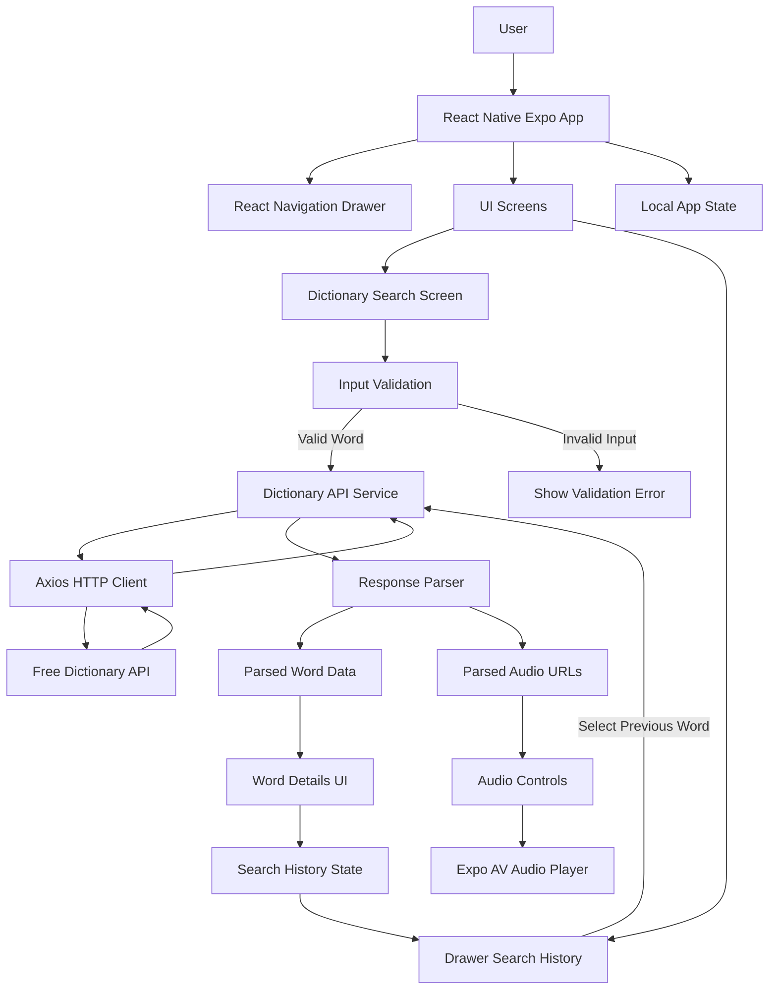

---

## 2. Data Flow Diagram

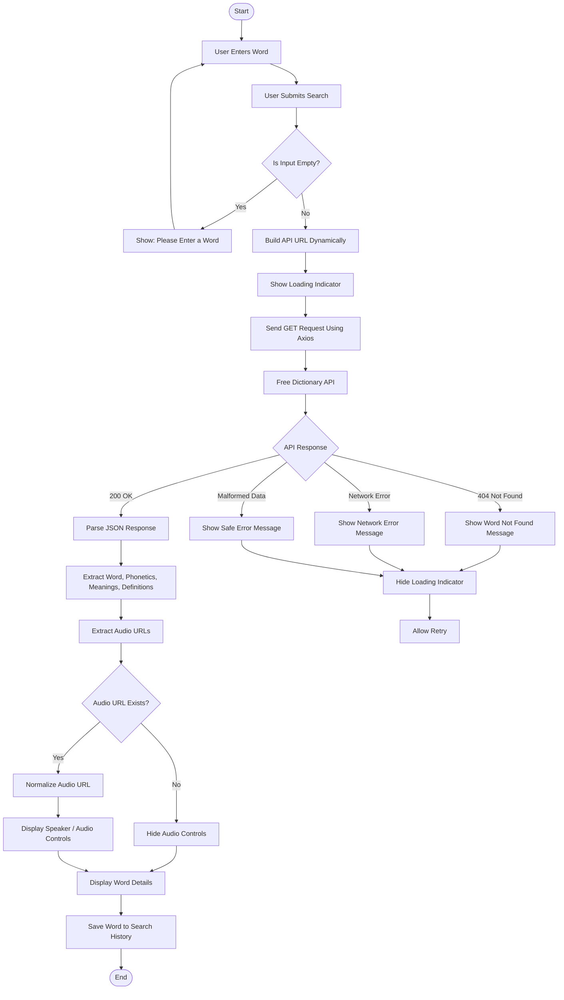

---

## 3. Search Flow

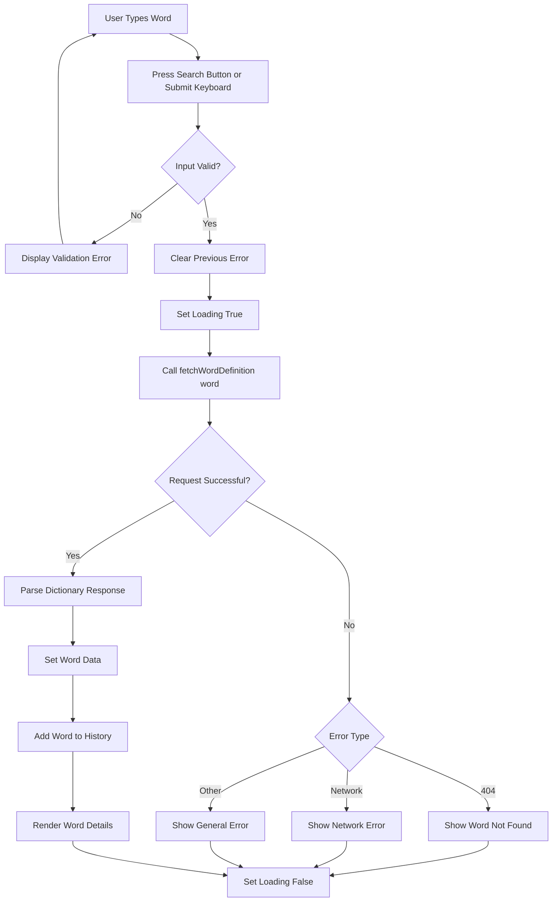

---

## 4. API Integration Flow

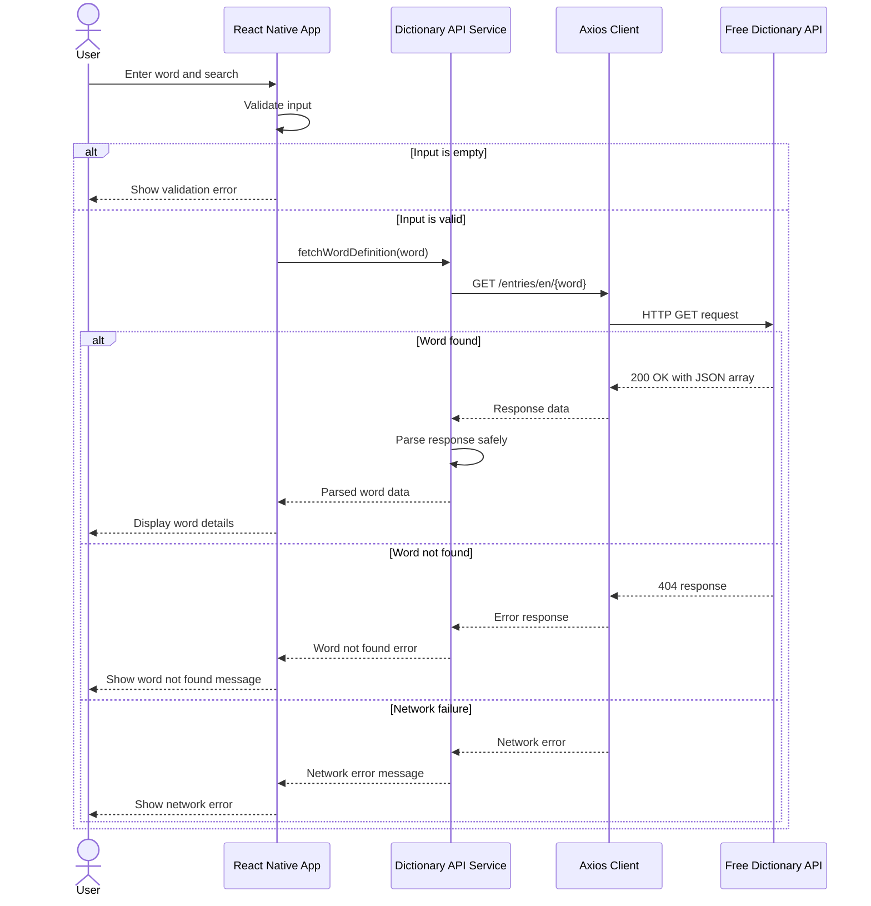

---

## 5. Audio Pronunciation Flow

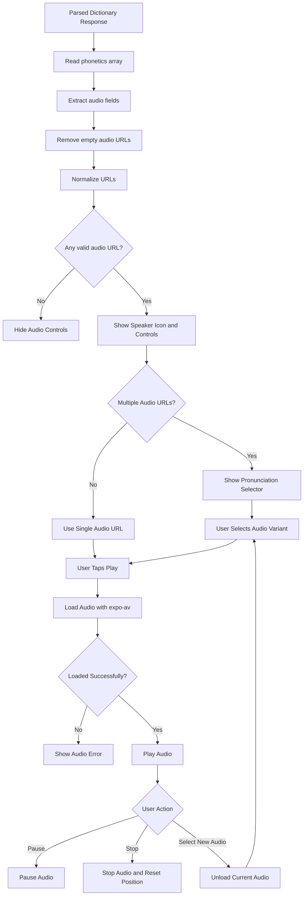

---

## 6. Audio State Machine

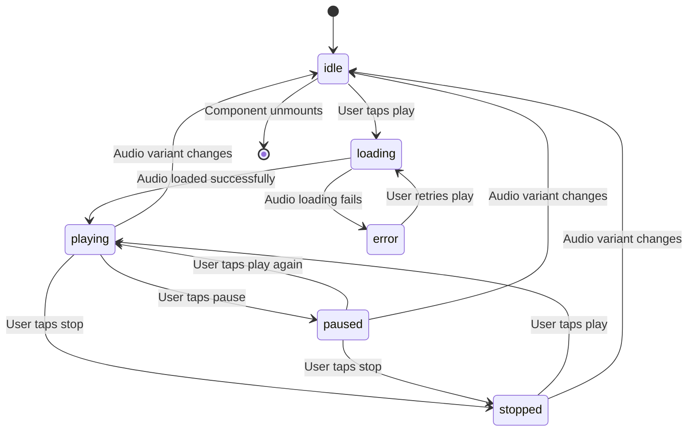

---

## 7. Drawer Navigation and Search History

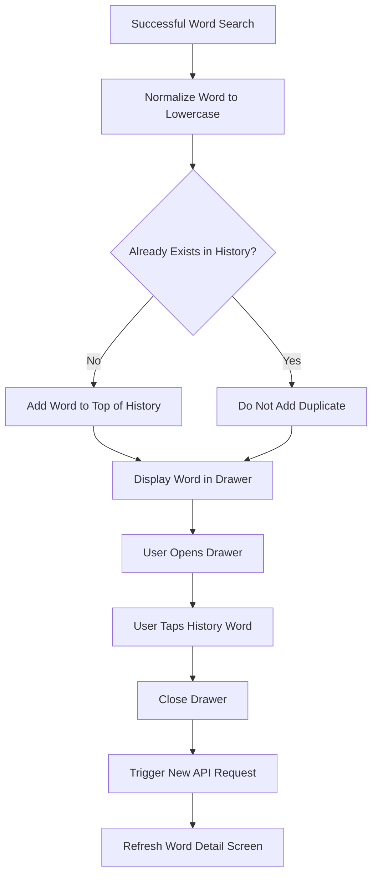

---

## 8. Screen Navigation Structure

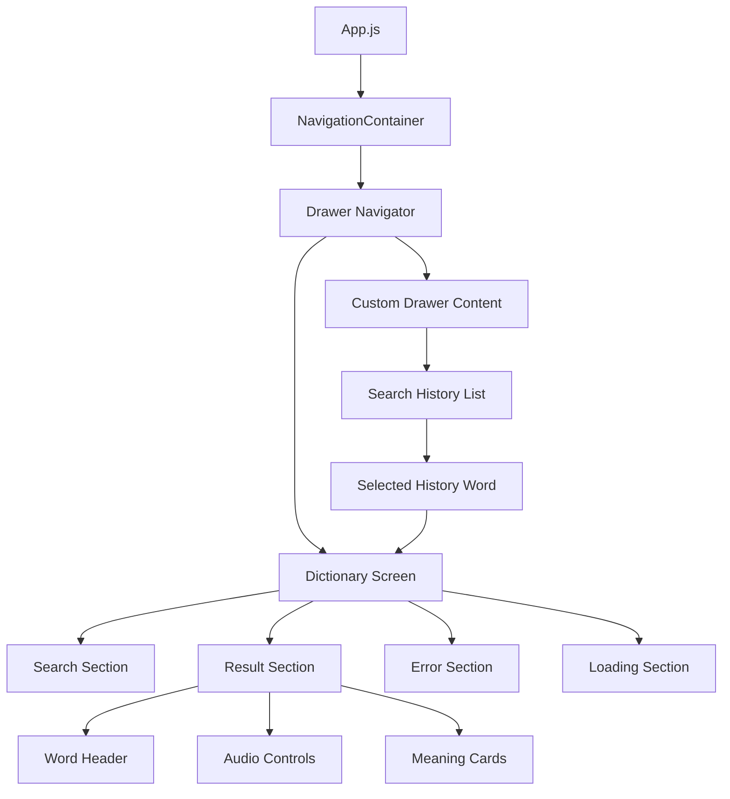

---

## 9. Component Structure

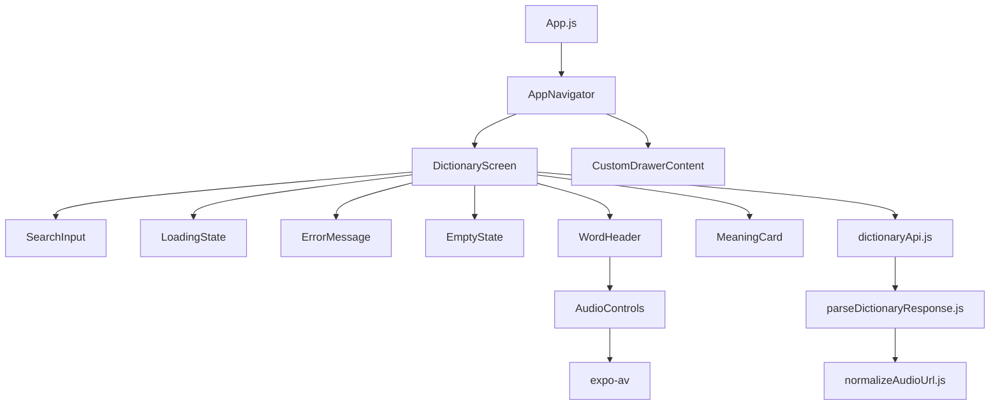

---

## 10. Error Handling Flow

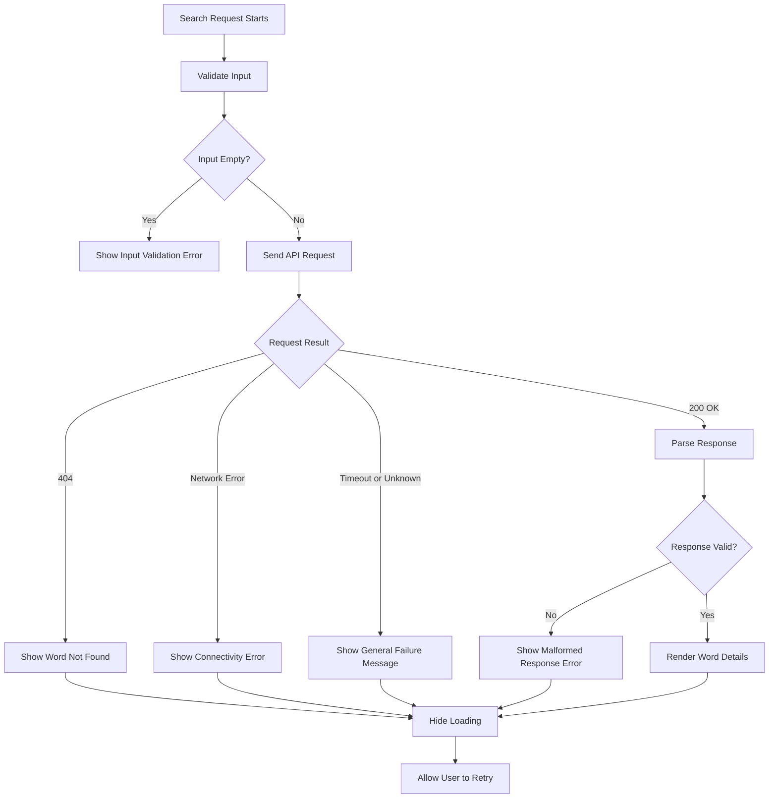

---

## 11. Complete System Activity Diagram

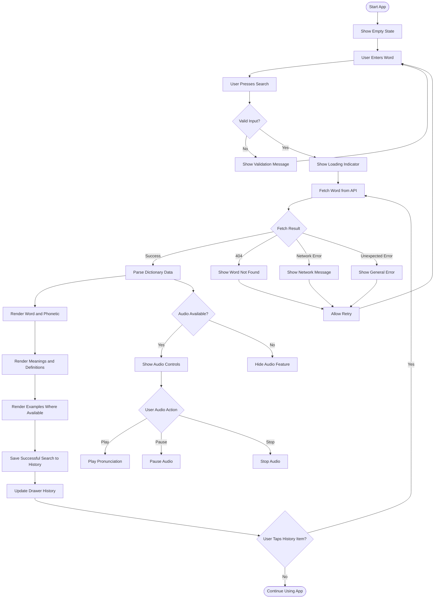

---

## 12. Deployment / Testing Flow With Expo

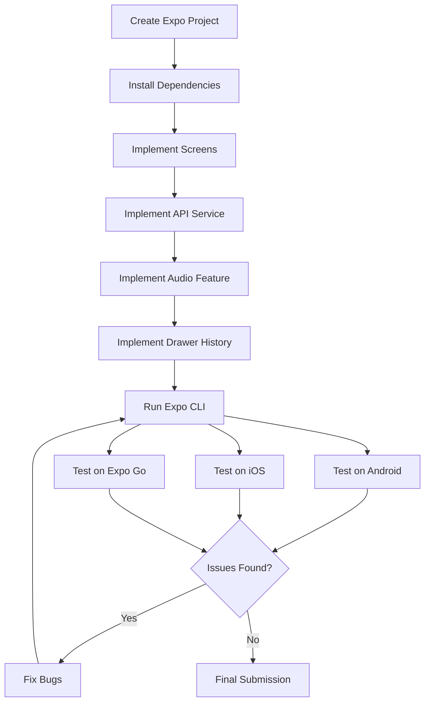

---

## 13. Documentation Index Mind Map

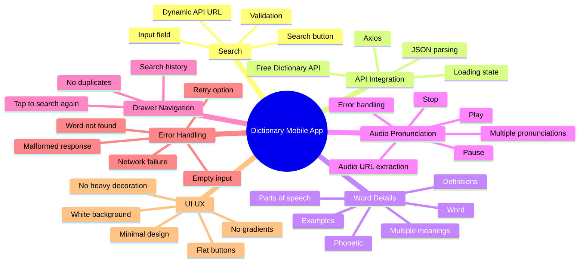