# Dictionary Mobile App - Documentation

This document reflects the current structure of the app in this repo:

- Expo Router routes under `src/app/`
- Android shell with drawer navigation
- Web shell with a responsive sidebar
- Free Dictionary API for definitions
- Datamuse API for autocomplete suggestions
- AsyncStorage-backed search history
- Expo AV pronunciation playback

---

## 1. App Structure

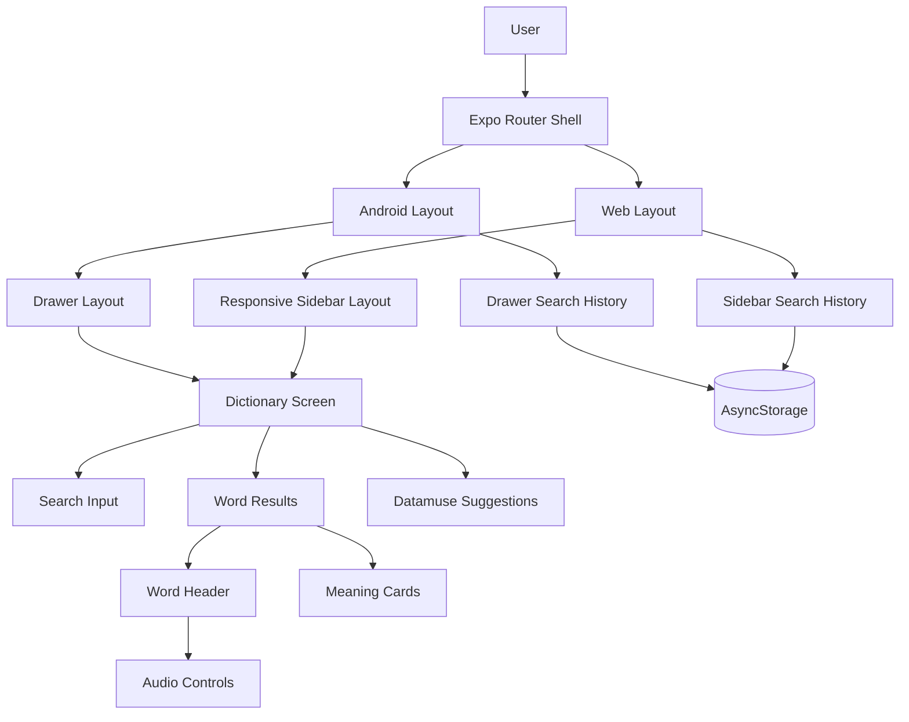

---

## 2. Route Structure

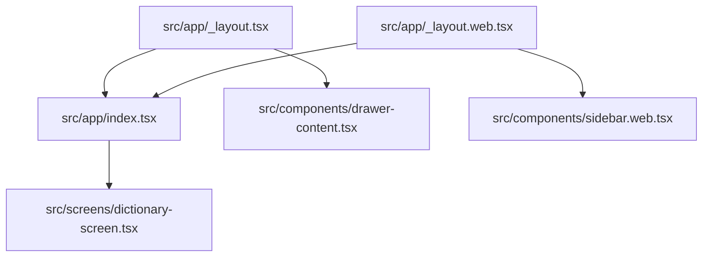

### Current routes

- `src/app/index.tsx` - main dictionary screen
- `src/app/_layout.tsx` - Android/native shell
- `src/app/_layout.web.tsx` - web shell

The app is no longer using the older template routes as part of the main flow.

---

## 3. Data Flow

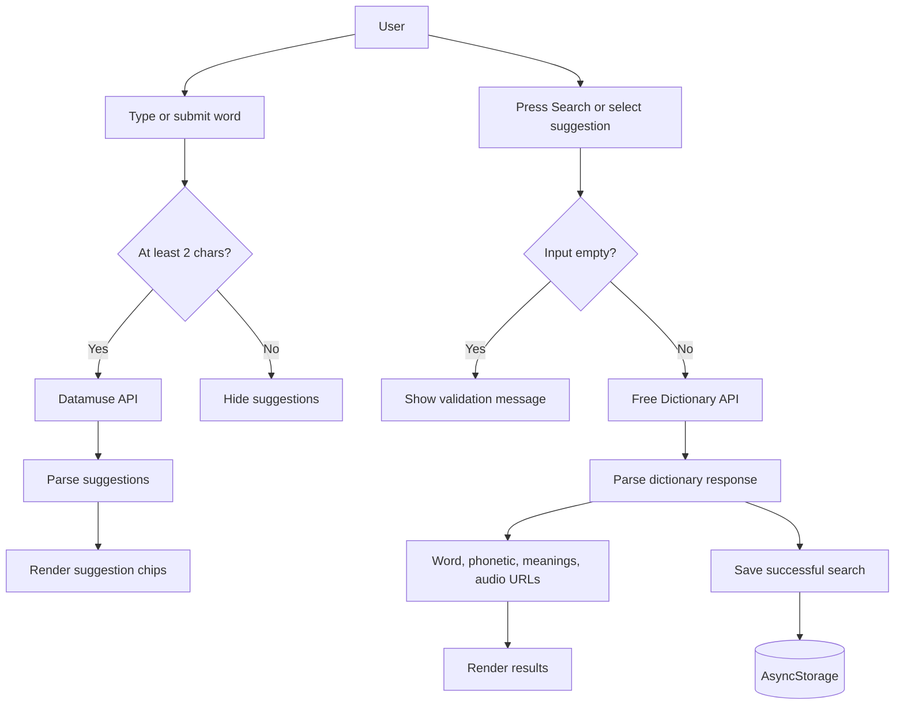

---

## 4. Dictionary API Flow

The app uses the Free Dictionary API:

```txt
https://api.dictionaryapi.dev/api/v2/entries/en/{word}
```

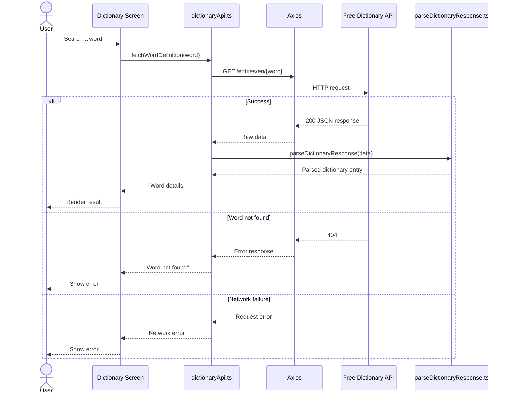

### Parsed output

`parseDictionaryResponse.ts` normalizes the API response into a clean shape:

- `word`
- `phonetic`
- `phonetics`
- `audioUrls`
- `meanings`
- `origin`

Audio URLs are normalized and deduplicated before rendering.

---

## 5. Suggestions Flow

Autocomplete comes from Datamuse, not the dictionary API.

Endpoint:

```txt
GET https://api.datamuse.com/sug?s={query}&max=4
```

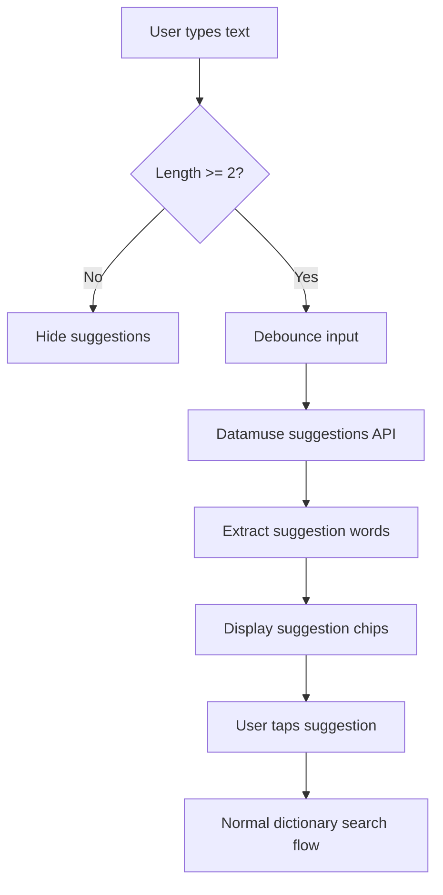

### Suggestion behavior

- Suggestions appear only when the query has at least 2 characters.
- Suggestion requests are debounced.
- Failed suggestion requests are ignored silently.
- Selecting a suggestion hides the list and runs the normal dictionary search.

---

## 6. Audio Playback Flow

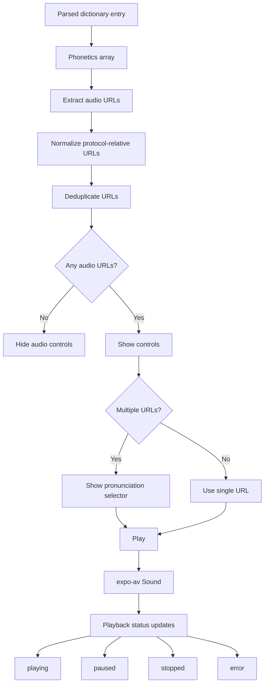

### Audio state model

```txt
idle
loading
playing
paused
stopped
error
```

### Important rules

- Audio is only loaded when the user plays it.
- The currently selected pronunciation can change without breaking playback.
- Stale audio loads are ignored if the user switches variants.
- Audio errors do not crash the screen.

---

## 7. Search History Flow

Search history is stored in AsyncStorage and exposed through `DictionaryProvider`.

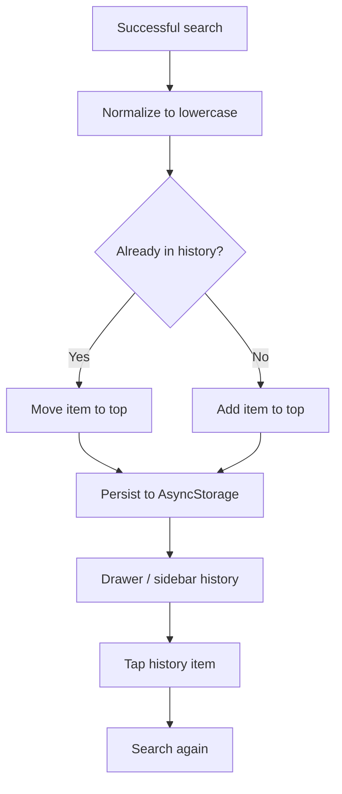

### History behavior

- Only successful searches are stored.
- History is unique and latest-first.
- History survives app restarts.
- Tapping a history item triggers a fresh dictionary lookup.

---

## 8. Shared State

`DictionaryProvider` stores:

- `data`
- `loading`
- `error`
- `history`
- `committedWord`

It also:

- fetches dictionary results
- updates search history
- hydrates persisted history from AsyncStorage

---

## 9. Screen Composition

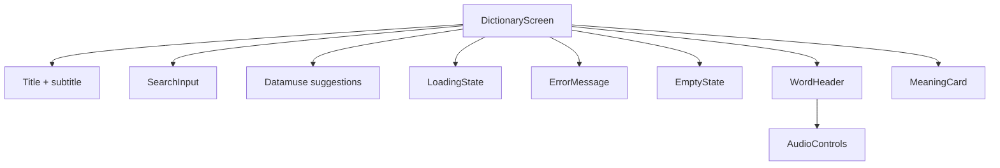

### Main UI parts

- `SearchInput`
- `WordHeader`
- `AudioControls`
- `MeaningCard`
- `ErrorMessage`
- `EmptyState`
- `LoadingState`

---

## 10. Android and Web Shells

### Android

- Uses `src/app/_layout.tsx`
- Uses the custom drawer shell
- Best tested with Expo Go or a dev build

### Web

- Uses `src/app/_layout.web.tsx`
- Uses a responsive sidebar
- Small screens open an overlay drawer
- Desktop keeps the collapsible sidebar behavior

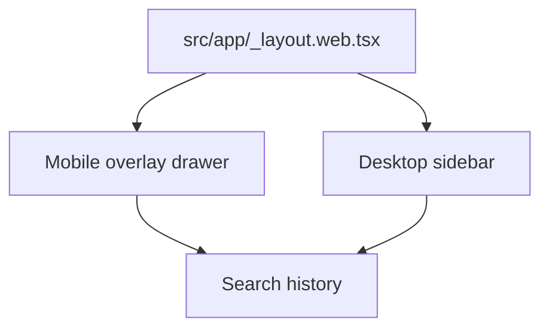

---

## 11. Error Handling

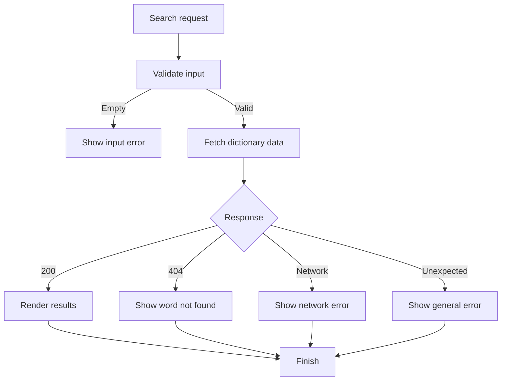

### Error handling rules

- Empty input is rejected.
- Dictionary 404s are shown as a friendly error.
- Network failures are shown as a friendly error.
- Datamuse failures are silent and never block dictionary search.
- Audio failures are shown in the audio component only.

---

## 12. Current File Map

```txt
src/
├── api/
│   ├── datamuseApi.ts
│   └── dictionaryApi.ts
├── app/
│   ├── _layout.tsx
│   ├── _layout.web.tsx
│   └── index.tsx
├── components/
│   ├── audio-controls.tsx
│   ├── dictionary-provider.tsx
│   ├── drawer-content.tsx
│   ├── drawer-layout.tsx
│   ├── empty-state.tsx
│   ├── error-message.tsx
│   ├── loading-state.tsx
│   ├── meaning-card.tsx
│   ├── search-input.tsx
│   ├── sidebar.web.tsx
│   └── word-header.tsx
├── screens/
│   └── dictionary-screen.tsx
└── utils/
    ├── normalizeAudioUrl.ts
    ├── parseDictionaryResponse.ts
    └── use-system-background-color.ts
```

---

## 13. Testing and Run Targets

Current project scripts:

```txt
npm start
npm run android
npm run web
npm run build
```

Recommended flow:

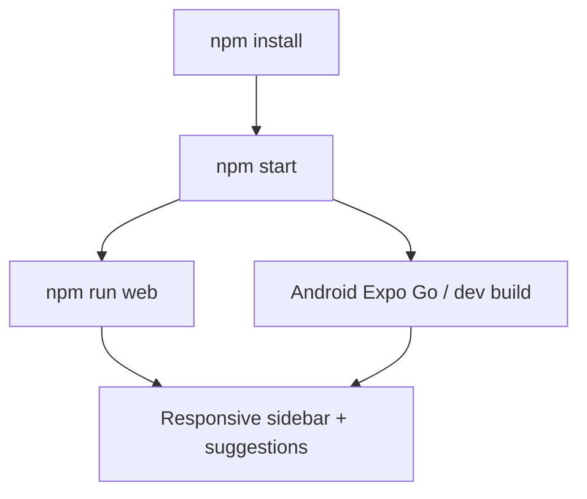

---

## 14. Summary

The app is now a dictionary experience centered around:

- dictionary lookup
- suggestion autocomplete
- audio pronunciation playback
- persisted history
- Android drawer navigation
- responsive web sidebar navigation

This document should be updated whenever the route structure, state model, or external APIs change.
